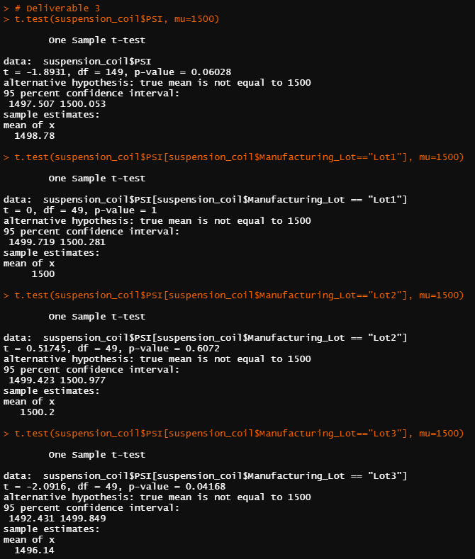

# MechaCar Statistical Analysis

## Overview

In this module we used R to examine trends in and conduct regression analysis on car data to assist AutosRUs

## Linear Regression to Predict MPG

We used R's lm() method to regress MechaCar MPG over vehicle length, weight, spoiler angle, ground clearance, and drive classification.  Out of these, vehicle length and ground clearance were statistically significant.  The model has a nonzero slope since at least one variable was significant.  This model predicts MechaCar prototype mpg pretty effectively, as it has an r-squared value of 0.7149, indicating that the model predicts the majority of the variation in the data.

## Summary Statistics on Suspension Coils

We used R's group_by() and summarize() methods to take data on MechaCar suspension coils.  We first calculated summary statistics for the entire group, and then separately for each lot group.

While the overall variance for the suspension coils was 62.29 PSI and appears within the design specifications, when examining the lot groups we see that almost all of the variance comes from lot three.  Lot one is almost entirely uniform, and lot two has a variance below ten PSI, but lot three has a variance of over 170 PSI, well over the specification limit and over twenty times the variance of either of the other lots.

## T-Tests on Suspension Coils

Across all manufacturing lots, the mean PSI is not statistically significantly different from the population mean of 1,500 PSI.  Our sample mean was 1498.78, with a p-value above 0.05 and a confidence interval containing 1,500.  This is consistent across the first two lots, but lot three had a p-value below 0.05 and a confidence interval that did not contain our population mean.  Thus, the mean PSI of lot three is statistically significantly different from our population mean of 1,500 PSI.

## Study Design: MechaCar vs Competition

One way to quantify the MechaCar against competition would be measuring the noise levels in decibels inside the cabin while driving for different vehicles.  The null hypothesis would be that the interior of the MechaCar while driving at forty-five miles per hour is on average as quiet or loud as the industry average, with an alternative that the MechaCar's average noise levels at forty-five miles per hour are not the same as the rest of the industry.  This would be conducted as a one-sample t-test.  To gather data, we could record interior noise levels of the MechaCar at forty-five miles per hour for five minutes and use the average reading as one entry.  If we have enough prototypes, we would like to record once in many MechaCars so one loud or quiet car does not disrupt our data.  Our population mean would be the mean industry noise level at forty-five miles per hour.  If this information is not available, we could repeat our data-gathering process on popular competitiors, but we would need to alter the collection process for both MechaCars and the competition to take potentially three or five readings per individual car, as we likely will not have the same access to other cars as we do to MechaCars and we want to be consistent.  This scenario would be run as series of two-sample t-tests to determine if there is a statistically signficiant difference in the mean interior decibel level at forty-five miles per hour between the MechaCar and a given competitor.  This would come with a null hypothesis of no significant difference and an alternative of the mean decibel levels at forty-five miles per hour for the MechaCar and for a given competitor being statistically significantly different.  We could test either of these scenarios at the alpha=0.05 level, as it could prove difficult testing enough cars to get to 0.01 or lower, especially if we are testing competition.  Additionally, noise level is secondary in importance to other safety factors that would be tested more rigorously, so the 0.05 level is probably acceptable for our purposes.
